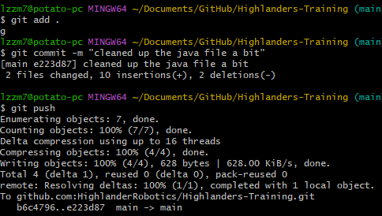

# Basic Git

## Git is a version control system, or a way for us to collaborate on code and manage having multiple versions of code working in parallel

While many modern cloud applications, like google docs, have some form of auto-save to the cloud, we don't necessarily want a single auto-updating version of our code.
Instead we use a tool called Git to manage different versions of our files and save them to Github, which lets us share the codebase between computers.
Instead of automatically syncing to Github, we save our code in small named chunks called commits.
The named versions makes it easy to revert changes that break previously working behaviour and see when and by who code was written.
Git also lets us have different versions, called branches, in progress in parallel.
This means that while one person works on code for the autonomous, another could work on vision, for example.

### Resources

- [WPILib Git intro](https://docs.wpilib.org/en/stable/docs/software/basic-programming/git-getting-started.html)
- [Github Git intro](https://docs.github.com/en/get-started/using-git/about-git)
- _Record quick intro to git vid/talk at some point, talk to kevin or a software lead until then_
- [Git install](https://gitforwindows.org/)

### Examples

- 
- Typing `git add .` then `git commit -m "commit name"` then `git push` is the bread and butter of using git.
  This sequence takes all of your uncommited changes and commits them, then pushes them to github
- `git checkout branch-name` switches between branches
- `git checkout -b new-branch` makes a new branch and switches to it.
  Note that the first time you push from this branch you will need to enter some extra parameters, but the terminal should prompt you with the correct command when you enter `git push`
- `git status` displays the current branch and what changes you have uncommited and staged
- `git pull` updates the code on your device with the latest code from Github.
  Recommended to do this whenever someone else has been working on the same branch, otherwise you might make conflicting changes
- [A simple demo video of commiting some changes](../../Assets/GitDemoVideo.mp4)

### Exercises

- Join Highlanders Robotics Github organization by asking Kevin to add your Github account
- Simple commit
  - Clone this repository from Github
  - Add your name to the list at the bottom of this file
  - Commit and push those changes
    - You may need to make an auth key for your account for this, ask a software lead or mentor for more help with this

### Notes

- _We may begin using Github's pull request feature in the future, update with current practices_
- Always commit code that at the very least compiles (you can check this by running the "Build robot code" option in WPILibs command bar)
- Commit messages should be short and simple, ~10 words is a good target.
  If it's too long, use multiple lines in the commit message
- Commits should be frequent, whenever you reach a working state you should commit before you accidentaly break anything again
- Commiting directly to the `main` branch is frowned upon.
  `main` should always contain working code when possible and features should be developed on separate branches and merged/pull requested in
- **ALWAYS ALWAYS ALWAYS** commit before you leave a meeting, especially if you are using a team computer.
  It is never fun to have to commit someone else's code at the start of the day or find out an hour in that you've been working off of someone elses uncommited (potentially broken!) code.
  Uncommited code also makes it harder to track what is and isn't finished
- Run a `git status` at the start of a meeting to make sure whoever was there before you commited their code and that you are on the right branch

### Names

- Lewy Seiden
- Petro Papahadjopoluos
- Sneha Narayan
- Aliya Vora
- Athena Li
- Jerry Yu
- Nathan Tuan (8/15/24)
- Sam Charlson
- Viviane Oesterer
- Jeffery Tornatore
