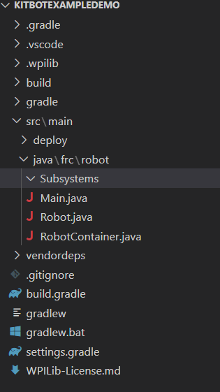
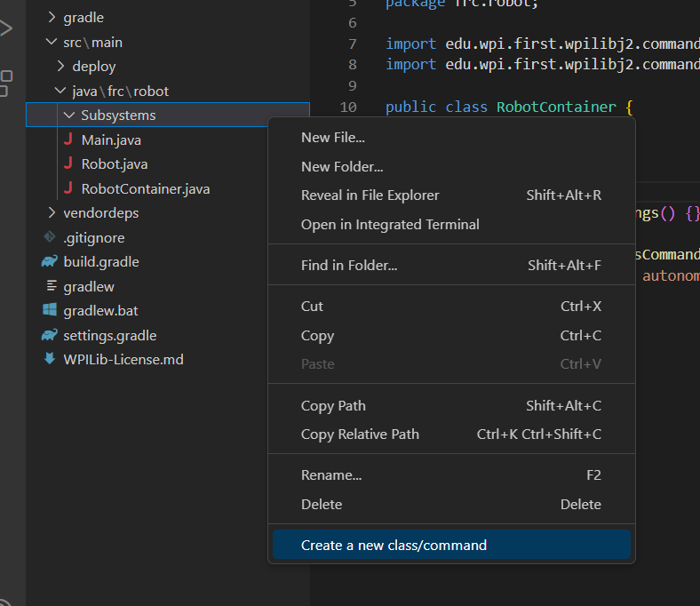

# Kitbot Code Tutorial

## Intro

### What is a kitbot?


The kitbot is a drivetrain which comes in the Kit of Parts provided by FIRST as part of registration.
It is a typical of example of a type of drivetrain known as a differential drive.
That name comes from the fact that the amount it turns is equal to the difference between the speed of the left and right sides.
This type of drive is also known as skid-steer or tank drive.

### Why kitbot?

We do not use the kitbot or other differential drive for our robots in competition.
Instead we use a much more versatile swerve drive.
However the code for a swerve drive is much more complex than a tank drive, which provides a good exercise to introduce you to programming FRC robots.
The kitbot has somewhat standard dimensions, gearboxes, wheels, and other physical characteristics so it makes for a consistent mechanism to start with.

### So what do we need to program?

Inputs/Outputs:

- A command that takes in velocity and rotational velocity, and outputs the correct wheel speeds to meet that.

Electronics:

- Each side of the chassis has two Falcon 500 motors, which will work together to power the left and right sides of the chassis.
In code this will look like a total of 4 Talon FX motor controllers, since thats the component we can talk to.

## Code Walkthrough

If you think you can figure out how to program this on your own, go for it!
However, check your work against this to see if you did it the same way.
If you have any questions about why we did it this way, ask a lead.

To start, open up WPILib vscode and create a new project.


Select `Template`, `Java`, `Command Robot Skeleton (Advanced)` as the template for your project.
Select whichever folder you want and title the project something along the lines of "Kitbot Example".
Set the team to 8033.
Make sure to enable desktop support, since it's necessary for simulation work which we will do on this project down the line.


Once you've created your project, open the src\main\java\frc\robot folder.
In this folder, create a new folder "Subsystems".



In that folder, right click and then click "create a new class/command"



Select Subsystem and name it DrivetrainSubsystem. This file is the subsystem file for the kitbot drivetrain.
It will contain all of the hardware that the drivetrain uses, in this case TalonFX motor controllers.
Other subsystems will contain sensors, solenoids, and more.
It will also contain methods that we use to interact with the subsystem from the rest of our code.

Our team names subsystem files using the NameSubsystem convention.
That means that our file should end in Subsystem, so it's clear what it is.
This will become more important later when we add AdvantageKit into our code.
The name should also be reasonably short and descriptive.
`IntakeSubsystem` is a good name.
`GreybotsGrabberSubsystem` is too long, and `CircleThingySubsystem` is not specific.

In this subsystem file we will need to add our hardware.
But to have access to the API for our motors, we need to install the CTRE Phoenix library.
Use the instructions [here](https://pro.docs.ctr-electronics.com/en/stable/docs/installation/pro-installation.html) to install the API.
Make sure to get the pro or v6 api.
For this project you may use the online installer, but if you want to use your computer to run and setup the robot it is useful to have Tuner X installed.

Once you have installed the vendor library, create two TalonFX objects in your subsystem called `leftFalcon` and `rightFalcon`.
By convention, hardware should have a succinct, descriptive name followed by the type of hardware it is.

```Java
{
    TalonFX leftFalcon = new TalonFX(0);
    TalonFX rightFalcon = new TalonFX(1);
}
```
